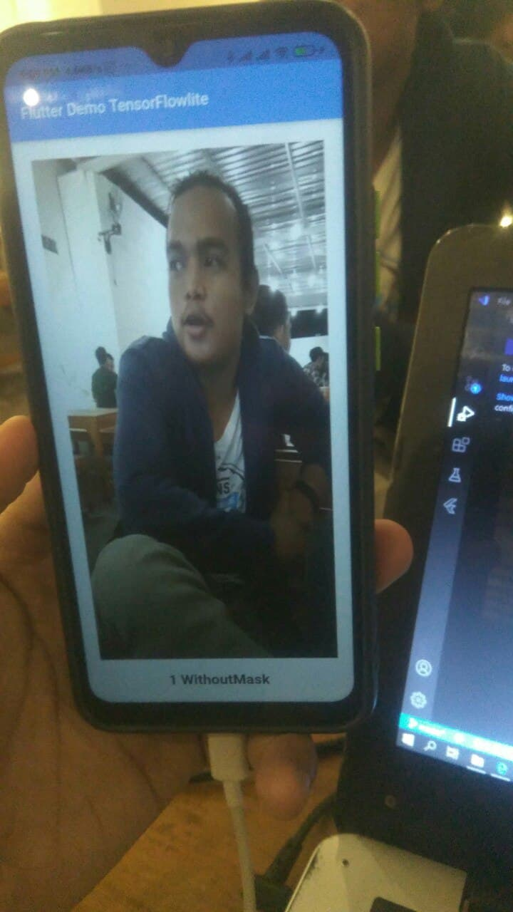

# flutter_maskdetection_tensorflowlite

Create app for detection of using mask with Tensorflow lite

This app using Tensorflowlite for mask detection.
The model can you find in folder model, this model take almost 3000 image for train model.
The model generated in https://teachablemachine.withgoogle.com/train/image

## Getting Started

1. Clone this project in to your PC or fork it.
2. You can change the model, if you have diferent model generated.(On main.dart line 56)
3. Run it with your smartphone. Noted\* when in debug mode, if you have done to build the app, disconnected it from your PC and run it.
4. Make sure your smartphone has android version 7+ or API 21+

## Screenshot

Mask Detection => 1 for without mask, and 0 with mask

